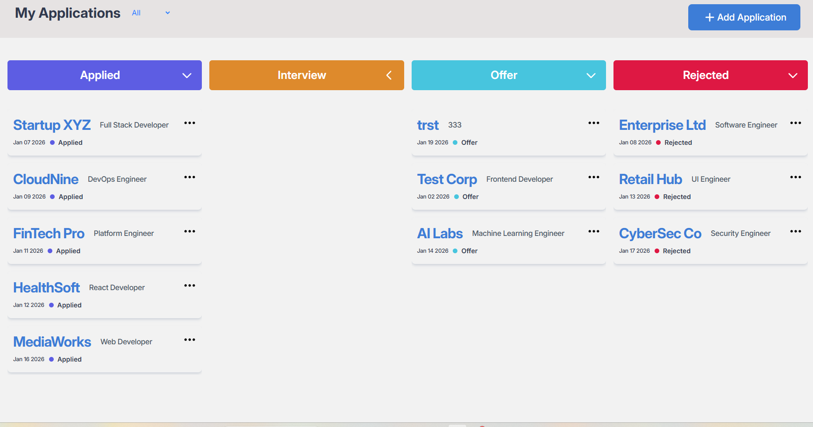
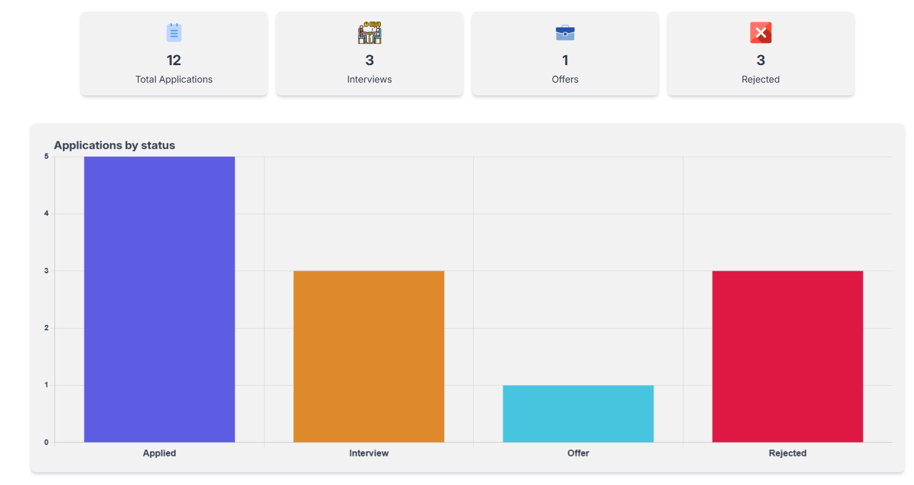
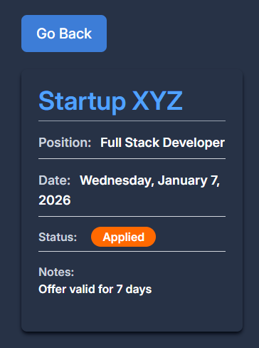
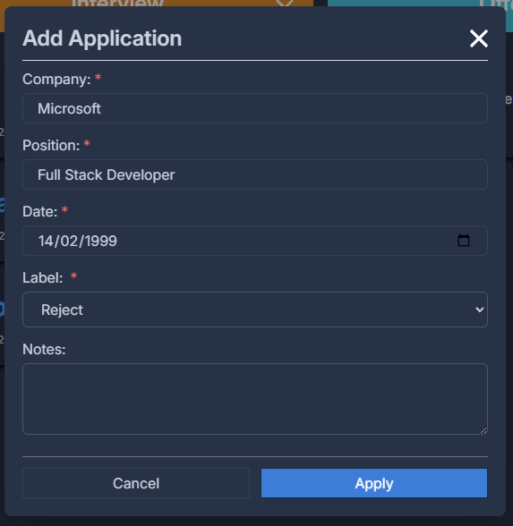
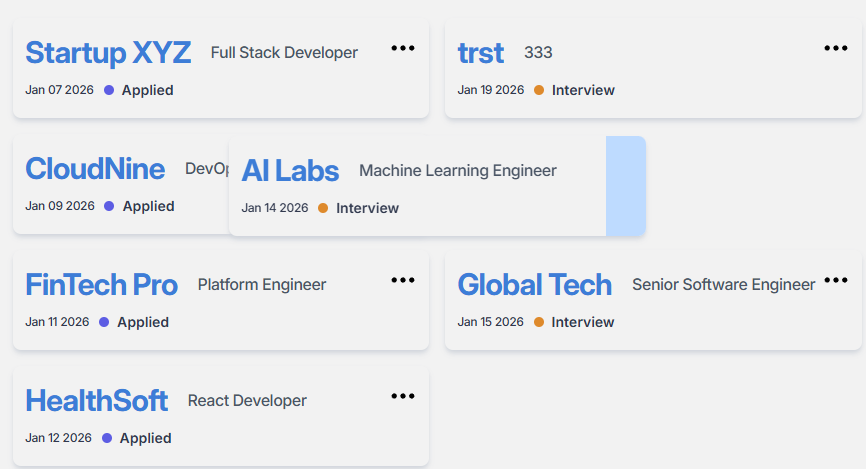
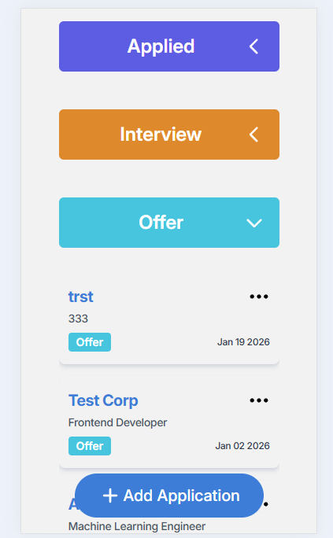

# 📊 Job Application Tracker

A responsive, accessible job application tracking web app that helps users manage applications across multiple stages using a Kanban-style workflow.

Built as a **frontend-focused portfolio project** to demonstrate real-world UI architecture, drag-and-drop interactions, form handling, accessibility, and data visualization.

## 🚀 Live Demo
[](https://job-tracker-psi-seven.vercel.app/)

---

## ✨ Features

### 📋 Kanban Board

* Four application stages (Applied, Interview, Offer, Rejected)
* Drag & drop cards between columns
* Clear visual drag indicators
* Empty column states with helpful messaging
* Badge counters per column

### 🧾 Application Cards

* Company name, role, date, and status
* Context menu (⋯) for edit & delete actions
* Card details page with full application info
* Cards are removed instantly on delete (no ghost state)

### ➕ Add / Edit Applications

* Modal-based form
* Form validation with clear error states
* Keyboard accessible modals
* Focus trapping and ESC-to-close support

### 📊 Analytics Page

* Visual breakdown of applications by status
* Charts built with Chart.js
* Clean, readable presentation for quick insights

### ⚙️ Settings Page

* Frontend-only configuration
* Structured to scale for future preferences

### 🚫 404 Page

* Friendly error state
* Clear navigation back to the app

---

## ♿ Accessibility

* Semantic HTML
* Full keyboard navigation
* Focus trapping for modals
* Correct tab order and focus cycling
* ESC key support
* ARIA attributes where appropriate
* Clear visual focus indicators

---

## 📱 Responsive Design

* **Mobile:** Single-column layout
* **Tablet:** Compact board layout
* **Desktop:** Full 4-column Kanban board

Built mobile-first and scaled up.

---

### 🛠 Tech Stack

**Frontend**


**State & Forms**


**Drag & Drop**


**Charts & Analytics**


**Full Stack FrameWork**


**Tooling**


---

## 🚀 Getting Started

```bash
git clone https://github.com/your-username/job-tracker.git
cd job-tracker
npm install
npm run dev
```

---

## 🎯 Project Goals

* Build a realistic frontend application similar to real-world job trackers
* Demonstrate:

  * Component-driven React architecture
  * Drag-and-drop UX patterns
  * Accessible modal and form design
  * State management without a backend
  * Clean, maintainable TypeScript code
  * Focus on **usability and clarity over feature bloat**

---

## 📸 Screenshots


| Desktop View | Analytics |
|--------------|-----------|
|  |  |

| Application Details | Add Modal |
|---------------------|------------------|
|  |  |

| Drag  | Mobile View |
|-------------|-------------|
|  |  |

---
## 🔮 Future Improvements

* Credentials Login/Sign up

---
## 👤 Author

**Ethan**
Frontend Developer
Portfolio Project – 2026
